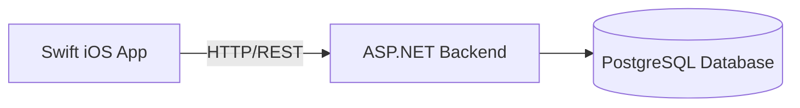
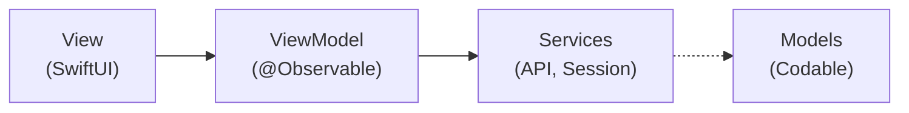
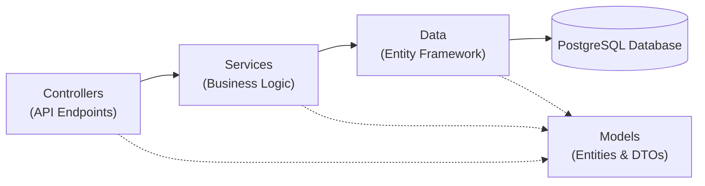

# MemeSOL 

A crypto wallet app that lets anyone launch a meme coin within seconds.

Landing Page: https://memesol.sunwookim.dev

Mirror: https://memesol.daniel-liu.dev

## Features

- Simple interface.
- Launch a meme coin within seconds.
- AI generate an image for your meme coin.
- Find and add other meme coins created by MemeSOL users.
- Send/receive tokens with a QR code.
- View live portfolio balance and transaction history.

## Tech Stack

- **Swift**
: iOS app

- **Next.js**
: Web

- **ASP.NET**
: Backend

- **PostgreSQL**
: Database

- **Docker**
: Containerization

- **Linux**
: Deployment Server

## System Architecture



### iOS App Architecture

This iOS Swift source follows the **MVVM** (Model–View–ViewModel) pattern for the iOS app.



### ASP.NET Backend Architecture

The ASP.NET backend is structured in a layered architecture with the following components:



## Running Locally
Requirements

- macOS with Xcode 16 or later iOS 17+ deployment target Swift 5.9+
- ASP.NET 10+

Backend
```bash
cd MemeSOL/apps/backend
./setup-env.sh # Enter a valid Solana mnemonic
./start-db.sh
dotnet ef database update
dotnet run
```

iOS App
```
Replace baseURL in MemeSOL/apps/ios/src/App/Services/API/APIClient.swift with your backend URL (e.g., http://localhost:5000)
Open MemeSOL/apps/ios/src/App.xcodeproj in Xcode and run on a simulator or device.
```

## Future Improvements
These features could not be implemented within the timeframe of the assignment due to the need of a valid Apple Developer account.

- Authentication with Apple Sign-In
- Buying tokens using Apple Pay
- Push notifications for transactions and price alerts
- Pricing data based on supply and demand (currently simulating by changing the price by +-5% every midnight)
